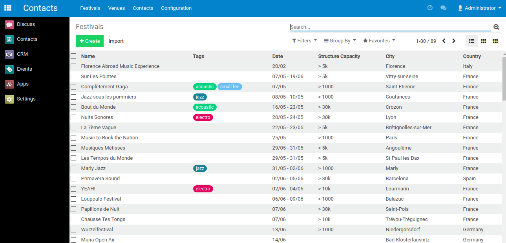
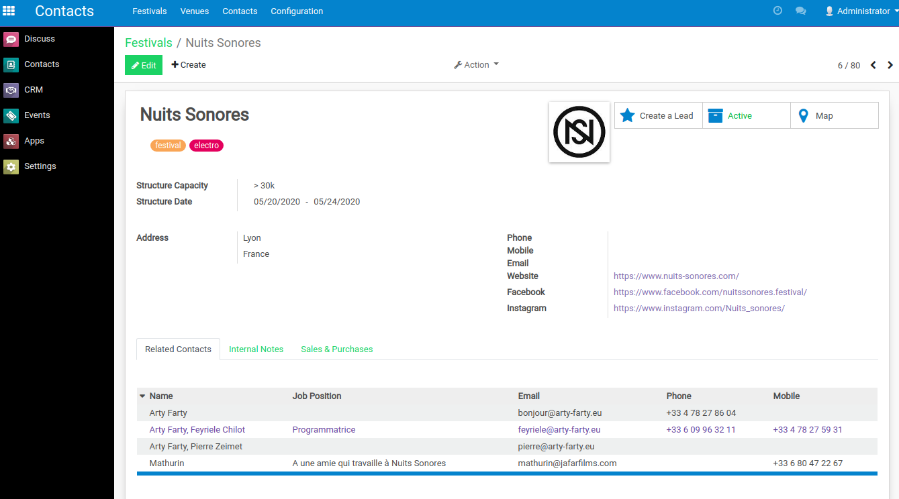
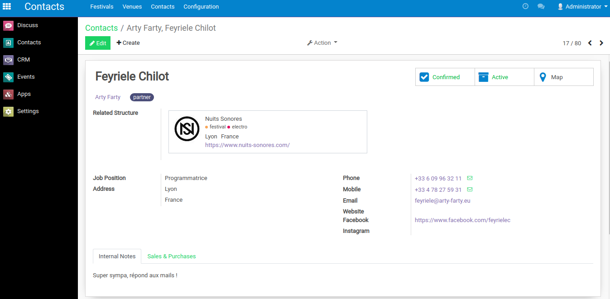

# Band booking and management with Odoo

Custom Odoo modules to help manage music band booking (and more!) with
[Odoo](https://www.odoo.com/).

A basic Odoo project usecase with these modules can be found at the
[odoo-band-template](https://github.com/clementmbr/odoo-band-template) repository.

`partner_structure <partner_structure>`_ Distinguish "Structure" partners (Festivals and
Venues for the moment) from classic "Contacts" partners.
`partner_category_type <partner_category_type>`_ Create "Category types" allowing to
make the difference between Strucures categories and classic Contacts categories.
`band_booking <band_booking>`_ Special link between Contacts, CRM Leads and Events along
other small customisations. `web_form_background_color <web_form_background_color>`_
Pure UX module displaying a custom background color in Leads and Events form view.

## What can I do with that ?

### Manage your contacts

No more headaches with obsolete and unreadable Excel sheets !

|   |  |
| :-------------------------------: | :-------------------------------: |
|  |   |

### Qualify your leads and follow up negociations

No more misunderstandings between the Booker and the Musicians !

### Follow up and share your previsional Tour Agenda

No more irational forecast !

### And more !

- Multi-band management (with customisable User access rights)
- Basic Leads and Events reporting
- Discuss platform between users
- Task management available on every Leads, Contacts and Events
- Opensource (License AGPL-3.0 or later)

## Roadmap

- Newsletters management
- Translation in French and Brazilian portuguese

# Author

Clément Mombereau <clement.mombereau@akretion.com.br>
